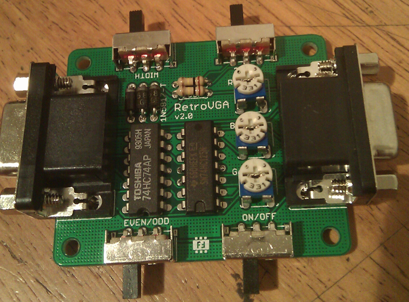

# RetroVGA 2

**Backup from 
http://www.brunofreitas.com/node/36**

It's self-powered from the VGA cable and you are free to play with the 4 switches at your will without being afraid of getting things fried!

The four switches in the board are:
ON/OFF: Turns the scanlines effect ON/OFF
EVEN/ODD: Tells the board to draw only ODD or EVEN scanlines
WIDTH: Tells the board to draw double (thicker) or single scanlines
VSYNC: Inverts VSYNC signal. Need to change it when you're using a VGA resolution different than 640x480@60Hz or 1024x768@60Hz, otherwise scanlines won't work.

RetroVGA is open-hardware released under CC-SA license. You can download Eagle 5.x schematics http://www.brunofreitas.com/sites/default/files/RetroVGA_12C.zip

RetroVGA 2 Eagle 5.x schematics can be downloaded http://www.brunofreitas.com/sites/default/files/RetroVGA_20.zip

**If you need a ready-to-use board, you can buy one from http://shop.brunofreitas.com/**

Thanks goes out to:
- sharksym for the original circuit
- Toodles for some improvements over the original circuit

Happy retro-gaming (with scanlines)! :)

Bruno

